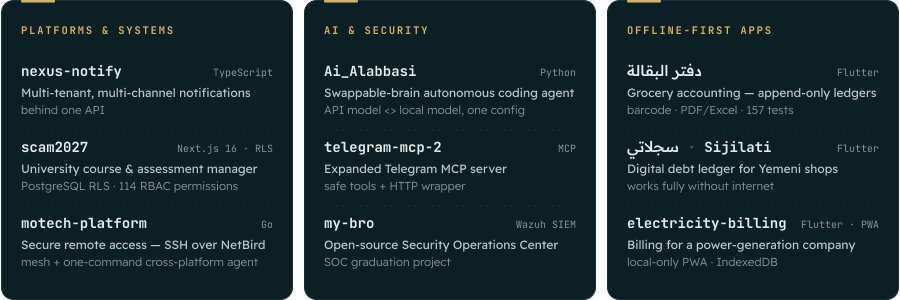

<a href="https://basirapp.site">
<picture>
  <source media="(prefers-color-scheme: dark)" srcset="assets/header-dark.svg">
  <source media="(prefers-color-scheme: light)" srcset="assets/header-light.svg">
  
</picture>
</a>

<picture>
  <source media="(prefers-color-scheme: dark)" srcset="assets/roles-dark.svg">
  <source media="(prefers-color-scheme: light)" srcset="assets/roles-light.svg">
  
</picture>

<picture>
  <source media="(prefers-color-scheme: dark)" srcset="assets/stack-dark.svg">
  <source media="(prefers-color-scheme: light)" srcset="assets/stack-light.svg">
  
</picture>

 

<a href="https://github.com/MoTechSys/Project-Basira">
<picture>
  <source media="(prefers-color-scheme: dark)" srcset="assets/basira-dark.svg">
  <source media="(prefers-color-scheme: light)" srcset="assets/basira-light.svg">
  
</picture>
</a>

  <a href="https://basirapp.site"><b>basirapp.site</b></a> ·
  <a href="https://github.com/MoTechSys/Project-Basira">Repository</a> ·
  <a href="https://basirapp.site/docs">API docs</a> ·
  <a href="https://t.me/BasiraCheckBot">@BasiraCheckBot</a>

<b>How Basira works</b> — engineering notes

 

Paste a post, an article, a chatbot answer or an image. Basira finds every quotation presented as Quran or Hadith,
matches it **byte-exactly** against licensed, sha256-pinned corpora (71,987 records), shows the verbatim source next to
the user's text with a **letter-level diff**, and returns one of four states. The language model only *proposes*
positions and reads images — **the deterministic engine decides**. No generated religious text, no rulings, no storage.

| Measured | Result |
|---|---|
| Evaluation (150 cases, 13 categories incl. prompt injection, 3 repeats) | **150/150**, variance 0 |
| False alarms on 500 verbatim corpus segments | **0/500** |
| IslamicEval 2025 · subtask 1B (dev) | **78.54 %**, only **2 / 100** wrong spans confirmed |
| Tests | 345 backend · 110 bot · 32 frontend · mypy `--strict` |

Corpus-anchored seed-and-extend detection (BLAST-style) · three-tier Arabic normalisation · numpy positional index
(< 5 ms / quote over 4.5 M tokens) · BM25 + char-3-gram + RRF retrieval · windowed token-Levenshtein · harakat gate &
rasm-uniqueness proof · 19 named safety invariants · validator that independently re-proves every “found” ·
`determinism_hash` on every response · REST, **MCP server**, Guard for chatbots, Telegram bot · one-command run.

> Entry to the *AI in Service of Islamic Content Challenge 2026* — Track 4 (knowledge & verification tools).

 

<picture>
  <source media="(prefers-color-scheme: dark)" srcset="assets/label-work-dark.svg">
  <source media="(prefers-color-scheme: light)" srcset="assets/label-work-light.svg">
  
</picture>

<a href="https://github.com/MoTechSys?tab=repositories">
<picture>
  <source media="(prefers-color-scheme: dark)" srcset="assets/work-dark.svg">
  <source media="(prefers-color-scheme: light)" srcset="assets/work-light.svg">
  
</picture>
</a>

<a href="https://github.com/moain2026/nexus-notify">nexus-notify</a> ·
<a href="https://github.com/MoTechSys/scam2027">scam2027</a> ·
<a href="https://github.com/moain2026/motech-platform">motech-platform</a> ·
<a href="https://github.com/moain2026/Ai_Alabbasi">Ai_Alabbasi</a> ·
<a href="https://github.com/moain2026/telegram-mcp-2">telegram-mcp-2</a> ·
<a href="https://github.com/MoTechSys/my-bro">my-bro</a> ·
<a href="https://github.com/MoTechSys/mohanad-web-app-2">دفتر البقالة</a> ·
<a href="https://github.com/MoTechSys/Sijilati">Sijilati</a> ·
<a href="https://github.com/MoTechSys/electricity-billing-flutter">electricity-billing</a> ·
<a href="https://github.com/moain2026/electricity-billing-pwa">PWA</a>

<b>+ 9 more</b> — tutoring platform, accounting, AI voice training, forensics lab, client websites

 

| Project | What it is | Stack |
|---|---|---|
| [**Idhaat-Platform**](https://github.com/MoTechSys/Idhaat-Platform) | منصة إضاءات — live tutoring: live classes, protected 48-hour recordings, homework, messaging; installable PWA | TypeScript · PWA |
| [**hesabati**](https://github.com/moain2026/hesabati) | حساباتي — multi-business financial & accounting system with an Arabic UI | TypeScript |
| [**ghaida**](https://github.com/MoTechSys/ghaida) | غيداء — trains domestic workers in their own language with AI voice, video and tailored schedules | TypeScript · Python |
| [**digital-forensics-lab**](https://github.com/moain2026/digital-forensics-lab) | Windows Registry, Event Log, Autopsy, FTK Imager, browser forensics — with real artifacts | PowerShell |
| [**motech-cli**](https://github.com/moain2026/motech-cli) | One-command cross-platform agent (Windows / Linux / macOS, amd64 + arm64) | Go |
| [**keif-aldiafa-web**](https://github.com/MoTechSys/keif-aldiafa-web) | كيف الضيافة — production site for a Saudi hospitality business (CRO, SEO/GEO, PDPL compliance) | Next.js · TypeScript |
| [**osoul-aldiafa-v2**](https://github.com/MoTechSys/osoul-aldiafa-v2) | أصول الضيافة — luxury hospitality website | Next.js 14 |
| [**royal-coffee-hospitality**](https://github.com/moain2026/royal-coffee-hospitality) | القهوة الملكية — Arabic hospitality site with a luxury identity, native RTL, high performance | Hono · Cloudflare Pages |
| [**alabbasi-soft-site**](https://github.com/moain2026/alabbasi-soft-site) | Official website of Alabbasi Tech, a software house in Sana'a | Next.js 15 |

 

<picture>
  <source media="(prefers-color-scheme: dark)" srcset="assets/label-live-dark.svg">
  <source media="(prefers-color-scheme: light)" srcset="assets/label-live-light.svg">
  
</picture>

<picture>
  <source media="(prefers-color-scheme: dark)" srcset="assets/live-stats-dark.svg">
  <source media="(prefers-color-scheme: light)" srcset="assets/live-stats-light.svg">
  
</picture>

<picture>
  <source media="(prefers-color-scheme: dark)" srcset="assets/live-grid-dark.svg">
  <source media="(prefers-color-scheme: light)" srcset="assets/live-grid-light.svg">
  
</picture>

  

<picture>
  <source media="(prefers-color-scheme: dark)" srcset="assets/label-toolbox-dark.svg">
  <source media="(prefers-color-scheme: light)" srcset="assets/label-toolbox-light.svg">
  
</picture>

I work with frontier AI coding agents — **Claude Opus 5.5 · Claude Fable 5.1 · GPT-6 Astra** via **Genspark** — under strict engineering rules: every safety invariant has a named test, every
number is measured and dated, every decision is recorded, and nothing ships without passing the gates.

<b>Toolbox</b>

 

- **Languages** · Python · TypeScript · JavaScript · Dart · Go · SQL · PowerShell
- **Backend** · FastAPI · Pydantic · Hono · Node.js · PostgreSQL · Drizzle · REST · Model Context Protocol (MCP)
- **Frontend & mobile** · React 19 · Next.js · Vite · Tailwind CSS · Flutter · PWA · RTL / Arabic-first UX · accessibility (axe)
- **AI & NLP** · Arabic text normalisation · information retrieval (BM25, n-grams, RRF) · fuzzy matching · LLM integration with constrained outputs · OCR pipelines · model benchmarking
- **Security** · SOC with Wazuh SIEM · digital forensics (Autopsy, FTK Imager, registry & event logs) · secure remote access (SSH, NetBird mesh)
- **Quality & ops** · pytest · vitest · Playwright · ruff · mypy strict · Docker · Caddy · GitHub Actions CI/CD · VPS deployment

> Two accounts: **[@MoTechSys](https://github.com/MoTechSys)** (main) · **[@moain2026](https://github.com/moain2026)** (systems, AI agents, client work).

 

<picture>
  <source media="(prefers-color-scheme: dark)" srcset="assets/footer-dark.svg">
  <source media="(prefers-color-scheme: light)" srcset="assets/footer-light.svg">
  
</picture>
